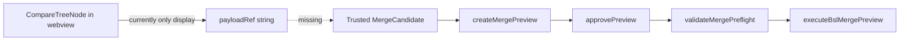
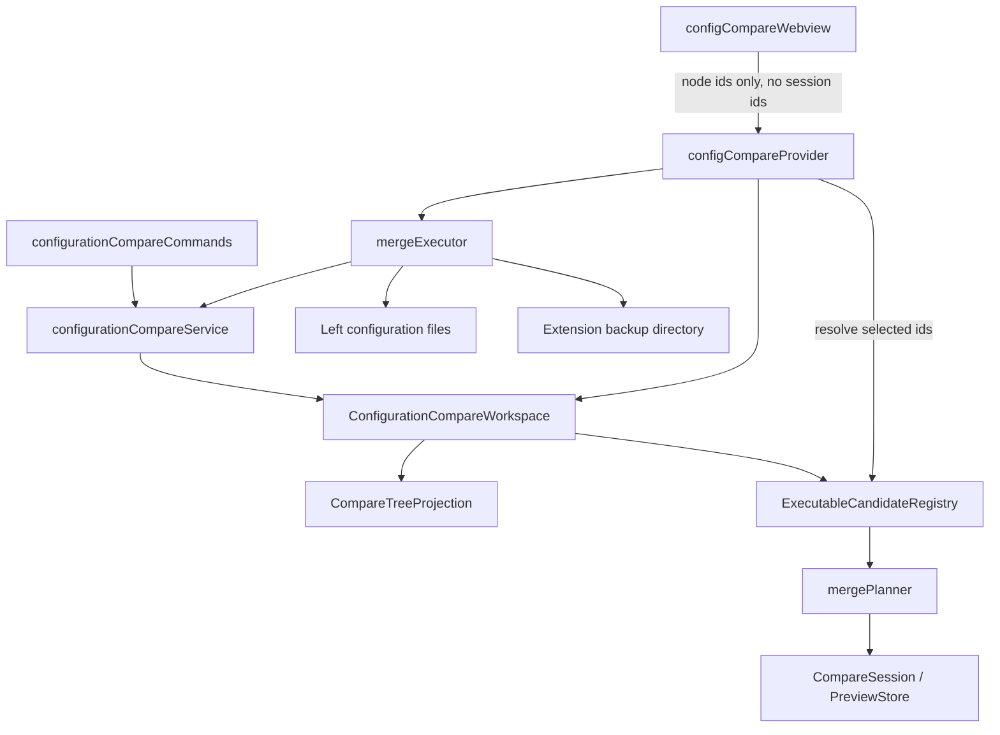

# Production Configuration Merge Design

## Goal

Bring the configuration compare/merge feature from foundation to production-ready for the first safe vertical slice:

- compare two file-based configuration dumps;
- select exactly one executable BSL routine change in the webview;
- create, approve, preflight, and execute merge previews from trusted host-side state;
- write with atomic single-file replacement, backup, stale-hash guards, and post-merge refresh;
- show metadata differences honestly, while blocking unsafe structural operations until their transaction model exists.

## Current State

The current branch has a compare foundation:

- `buildConfigurationCompare()` builds a `CompareSession` and `CompareTreeProjection`;
- metadata identity matching works by uuid / qualified name;
- BSL modules are diffed by routines;
- `executeBslMergePreview()` can safely apply `bslLogicalRoutineMerge` operations;
- the webview renders a static tree only.

The production gap is the missing bridge:

The webview must never send target paths, backup paths, operation payloads, or hashes. It may send only selected node ids. All executable data is resolved inside the extension host from stored compare state.

## Options

### Option A: UI-first

Add checkboxes and buttons around the existing projection, then connect the executor later.

Trade-off: fast visual progress, but it risks building UI state that cannot safely execute.

### Option B: Full generic merge engine first

Build a universal multi-file transaction engine for BSL, XML metadata, XDTO, roles, forms, and configuration root updates.

Trade-off: architecturally clean, but too large and too slow for the current feature slice.

### Option C: Production vertical slice

Add a host-side compare workspace with trusted candidate registry, wire BSL logical merge end-to-end, and keep metadata structural merge blocked until its own safe executor exists.

Recommendation: **Option C**. It gives users a real, safe merge path and keeps unsupported changes visible but non-executable.

## Scope For This Production Slice

This slice deliberately ships one safe executable path:

- exactly one approved executable BSL logical routine operation per preview;
- one target file per preview;
- one atomic file replacement per execution;
- metadata, XDTO, object add/delete/rename, uuid conflicts, routine add/delete/replace/reorder, and manual BSL edits remain visible but non-executable.

This restriction is not a UI convenience. It is the transaction boundary that keeps the first production release honest. Multi-selection and coalesced multi-file writes require a separate transaction design.

## Architecture

### ConfigurationCompareWorkspace

New host-side object returned by `buildConfigurationCompare()`:

- owns `CompareSession`;
- owns current `CompareTreeProjection`;
- owns source roots and snapshot ids;
- stores BSL module index entries and source text needed to build merge candidates;
- exposes `createPreviewForNodeIds(nodeIds)`;
- exposes `executeApprovedPreview(previewId)`;
- refreshes compare state after a successful write;
- invalidates all selection and preview state on refresh;
- is disposed with the webview panel, clearing candidate registry, approved previews, and backup plans.

The webview receives a serialized payload, not the workspace itself.

The webview never supplies or chooses a session id. The provider binds one workspace instance to one panel instance and routes messages to that workspace only. Messages from a stale panel, disposed workspace, or after refresh are ignored and logged.

### Snapshot Guard

The compare service registers left and right snapshots immediately after indexing:

- snapshot id includes source side and a content hash of indexed file paths/hashes;
- preview creation uses those snapshot ids;
- refresh after write creates a new session or updates snapshots before rendering again.

This closes the current `CompareSession.createPreview()` gap.

### Executable Candidate Registry

For each BSL routine node, the service stores a host-side candidate factory keyed by `CompareTreeNode.id`.

Factory rules:

- only changed routines with both left and right routine info are eligible;
- status `added`, `deleted`, `reordered`, duplicate routine diagnostics, parse diagnostics, ambiguous module targets, and metadata nodes are not executable in this slice;
- the factory reads the current target file at preview time, computes `expectedOldHash`, builds a logical plan from base/current/incoming snapshots, and returns `bslLogicalRoutineMerge` only when the plan status is `auto`;
- if the plan is `manual`, the preview returns diagnostics and writes nothing.

For this two-way compare slice, `base` and `current` are the left routine snapshot. This makes "incoming inserted a supported logical block while current is unchanged from compare baseline" executable. Existing-block edits remain manual.

### Preview And UI DTO Boundary

Preview creation produces two shapes:

- trusted host payload: operations, hashes, target paths, backup plan, rollback plan, and guard payload;
- redacted UI payload: `previewId`, summary, executable count, display items, and diagnostics.

The redacted payload must not include target paths, backup paths before execution, operation payloads, hashes, snapshot ids, or rollback material. `previewReady` therefore sends only:

- `previewId`;
- `summary`;
- `operationCount`;
- `items: { nodeId, label, kind, status }[]`;
- `diagnostics`.

Backup paths may be shown only after execution, as part of the result. `approvePreview` and `executeMerge` accept only a `previewId`; the host resolves the stored approved preview from its workspace. Execution succeeds only for an approved, current-workspace, non-stale preview.

### Target And Backup Boundaries

The provider builds backup and rollback plans inside an extension-owned backup directory. Paths are host-generated:

- `context.globalStorageUri/merge-backups/<workspaceId>/<previewId>/<random>.bak`;
- backup paths must not come from the webview;
- backup files must be unique and must not pre-exist;
- target files must be under the left configuration root;
- for now, execution blocks more than one operation or more than one target file per preview.

Canonical path contract:

- resolve the left configuration root and target file through realpath/canonical path before validation;
- on Windows, compare canonical paths case-insensitively;
- require the target canonical path to be equal to the root or prefixed by `root + pathSeparator`;
- reject symlink, junction, or reparse-point escapes from the left root;
- reject missing target files for this slice;
- sanitize display names, but use random backup and temporary basenames rather than user-controlled filenames.

### Atomic Write Contract

Execution uses a single-file atomic replace helper rather than direct `writeFile(target)`:

1. Resolve and validate canonical target path inside the left root.
2. Read current target content and verify `expectedOldHash`.
3. Create the backup directory under extension storage.
4. Write the backup to a random path that did not previously exist.
5. Re-read or hash the target immediately before replacement and verify it still matches `expectedOldHash`.
6. Write the next content to a host-generated random temporary file in the same target directory, using exclusive create semantics.
7. Flush and close the temporary file.
8. Atomically replace the target with the temporary file.
9. If any step after backup creation fails, attempt to restore from backup and report both the original failure and restore result.
10. Delete the temporary file on failure when possible.

The executor reports success only after the target hash equals the preview `newHash`. A failed restore is a high-severity diagnostic with the backup path.

### Webview Protocol

Add `src/compareMerge/configCompareMessages.ts`.

Webview to extension:

- `ready`;
- `selectionChanged { nodeIds }`;
- `createPreview { nodeIds }`;
- `approvePreview { previewId }`;
- `executeMerge { previewId }`;
- `refresh`;

Extension to webview:

- `state { payload, selectedNodeIds, busy, preview? }`;
- `previewReady { previewId, summary, operationCount, items, diagnostics }`;
- `mergeSuccess { applied, backupPaths, payload }`;
- `mergeError { message, diagnostics, locked? }`.

Invalid messages are ignored with a diagnostic log and do not execute.

The UI permits at most one executable node to be selected for preview. If the user selects zero or more than one executable node, preview and execute actions stay disabled and the UI explains the selection constraint. Non-executable nodes can be focused for inspection but cannot become execution input.

### Metadata Merge

Metadata is not promoted to executable in the first BSL vertical slice. Scalar metadata merge is explicitly out of this implementation step. The production path after BSL is:

1. `metadataScalarPropertiesReplace` for matched single-file XML objects only.
2. Explicit blocklist: `Name`, `Synonym`, `Type`, `InternalInfo`, collections, references, `ChildObjects`, `Ext`, `Rights.xml`, `Form.xml`, `Package.bin`.
3. Coalesce scalar patches per target XML file.
4. Separate metadata executor or dispatcher; do not overload `executeBslMergePreview()`.

Right-only object add, delete, rename, uuid conflict resolution, XDTO content merge, and root `Configuration.xml` structural changes remain visible but blocked until multi-file transaction support is designed.

## Error Handling

- Preview creation returns diagnostics instead of throwing for unsupported selected nodes.
- Preflight blocks stale hashes, missing backups, target outside left root, multiple executable operations, multiple target files, and unsupported operation kinds.
- Execute shows applied count, failures, and backup paths.
- After success, the provider rebuilds compare state and posts fresh payload.
- If refresh fails after a successful write, the provider reports the write result and backup paths, then locks stale UI actions. The user can refresh the compare view; stale selection/preview data cannot execute.

## Testing Strategy

Unit:

- candidate registry resolves only server-side node ids;
- forged webview target / backup data is impossible because protocol has no such fields;
- added/deleted/reordered routines are not selectable;
- changed routine with supported inserted block creates an approved preview and writes expected target;
- manual plan returns diagnostics and writes nothing;
- backup path lives under backup root and refuses pre-existing backups;
- target outside left root is blocked;
- path prefix tricks, case variance, and symlink/junction escapes are blocked;
- atomic writer restores from backup on post-backup failure when possible;
- stale UI preview cannot execute after refresh or workspace disposal.

Webview:

- CSP nonce remains;
- checkboxes render only for mergeable executable nodes;
- selected count and buttons update;
- messages use `acquireVsCodeApi()`;
- UI-visible copy does not call the feature an MVP.

Integration:

- temp left/right configs with one BSL routine logical insertion;
- compare -> select -> preview -> approve -> execute -> target changed -> backup exists -> projection refreshes.

Quality gate:

- `npx tsc --noEmit --pretty false`;
- `npx tsc -p tsconfig.test.json --pretty false`;
- targeted compare/merge mocha suites;
- `cmd /c test-suite.bat`;
- `build-all.bat` only when explicitly asked for release/build artifact.

## Production Acceptance

The feature is production-ready for this slice when:

- no operation can write using data supplied by the webview;
- every executable operation has preview, approval, preflight, backup, and stale hash guards;
- unsupported metadata and BSL structural changes are visible and explicitly non-executable;
- the UI can complete a real BSL logical merge without terminal steps;
- tests cover success, stale, forged selection, manual plan, and backup boundaries;
- the only unstaged user file remains outside commits.
