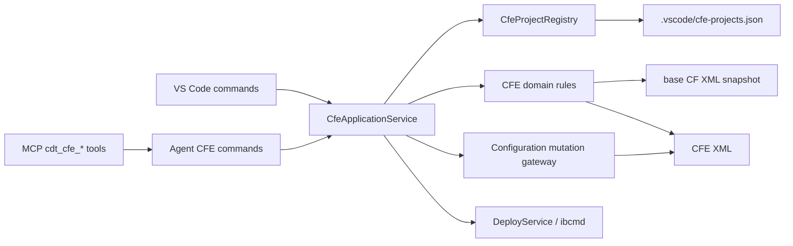

# Жизненный цикл расширений конфигурации (CFE)

Статус: принято к реализации для первых трёх частей issue #4.

## Контекст и границы

Цель — сделать расширение конфигурации полноценным проектом CDT, а не ещё одним независимо
обнаруженным каталогом XML. Первая очередь включает:

1. создание CFE и устойчивую связь с основной CF;
2. CRUD собственных и заимствованных объектов CFE;
3. создание перехватов и расширение форм.

Поддерживаются Designer XML форматов 2.17–2.21. EDT, создание пустой CF, создание EPF/ERF и
преобразование встроенных обработок во внешние не входят в эту очередь. Загрузка/выгрузка CFE
в информационную базу использует уже существующий `ibcmd --extension`; Configurator остаётся
резервным transport только там, где `ibcmd` соответствующей версии платформы не предоставляет
операцию.

## Источник истины и инварианты

- XML основной конфигурации и CFE — источник истины для UUID, состава и принадлежности объектов.
- Связь проекта хранится явно, но не дублирует доменные данные XML: запись содержит только пути
  base/CFE и выбранное имя расширения для команд платформы.
- CFE имеет собственную `ConfigurationSession`; запись никогда не маршрутизируется в сессию CF
  только потому, что каталог CFE физически вложен в каталог CF.
- Собственный объект не содержит `ObjectBelonging` и `ExtendedConfigurationObject`.
- Заимствованный объект содержит `ObjectBelonging=Adopted` и валидный UUID исходного объекта в
  `ExtendedConfigurationObject`. Имя используется для отображения, UUID — для идентичности.
- Обычные rename/delete и произвольная запись свойств запрещены для заимствованного объекта.
  Его разрешённые изменения выражаются отдельными CFE-операциями.
- Создание собственного объекта применяет `NamePrefix` CFE. Обход префикса возможен только явным
  параметром в Agent API; UI по умолчанию не предлагает его.
- Заимствование идемпотентно по UUID исходного объекта. Повторная операция не создаёт дубль.
- Любая мутация проходит через план, CAS и очередь CFE-сессии. Чтение CF фиксируется fingerprint;
  изменение исходника до commit даёт конфликт, а не молчаливо устаревшую копию.
- `ConfigDumpInfo.xml` не синтезируется: минимальный корректный source CFE может его не иметь,
  платформа создаёт/актуализирует файл при round-trip.
- Для заимствованной формы ID исходных элементов лежат в диапазоне 1–999999, новые элементы CFE —
  от 1000000; `BaseForm` обязателен и записывается последним разделом формы.
- `PropertyState=Extended` создаётся только начиная с формата 2.19.
- Все UI-команды вызывают тот же application service, что Agent API; MCP остаётся тонкой обёрткой
  над каждой Agent-командой.

## Рассмотренные варианты

### 1. Запуск готовых Python-скриптов cc-1c-skills

Это самый быстрый путь к широкому покрытию форм, но он добавляет Python как runtime-зависимость,
усложняет отмену/rollback и увеличивает VSIX. Отклонён как production-архитектура. Скрипты и их
snapshots используются как спецификация и oracle в тестах.

### 2. Независимая реализация всей модели CFE на TypeScript

Даёт чистую интеграцию с текущими mutation plans, но повторяет большой объём уже проверенных правил
форматов и повышает риск несовместимого XML. Отклонён как неоправданное дублирование знаний.

### 3. TypeScript application service + портирование канонических правил — выбран

CDT владеет контекстом, безопасностью путей, сессиями, транзакциями, UI и Agent/MCP. Чистые
TypeScript domain-функции портируют только необходимые правила `cfe-init`, `cfe-borrow`, patch и
validate из MIT-проекта cc-1c-skills. Совместимость подтверждается его fixtures и реальным
round-trip платформы.

## Компоненты

`CfeProjectRegistry` разрешает связь base↔CFE и валидирует, что оба пути принадлежат текущему
workspace. `CfeApplicationService` — единственная прикладная граница. Domain rules не знают о VS
Code, файловой системе или MCP и возвращают декларативные изменения/диагностику.

## Устойчивая связь CF↔CFE

Файл `.vscode/cfe-projects.json` имеет версионируемую схему:

- `version: 1`;
- `projects[]` с `baseConfiguration`, `extensionConfiguration`, `extensionName`;
- пути относительны корня workspace и используют `/`;
- пара путей уникальна, выход за workspace и symbolic-link escape запрещены.

Случайный runtime `configurationId` в файл не пишется. После discovery registry сопоставляет пути
с актуальными `ConfigurationSession` и строит `CfeProjectContext`:

- `baseSession`, `extensionSession`;
- `baseRoot`, `extensionRoot`, `extensionName`;
- `purpose`, `namePrefix`, `formatVersion`, `compatibilityMode` из CFE XML;
- UUID и fingerprint основной конфигурации.

Для стандартного каталога `ConfigurationExtensions/<Name>` связь может быть предложена
автоматически, но становится устойчивой только после записи manifest. Имя расширения для binding
определяется и из `ConfigurationExtensions`, и из EDT-каталога `Extensions`.

## Создание CFE

Контракт `createProject` принимает base configuration id, имя, purpose, prefix, compatibility mode
и необязательный относительный target. Сервис:

1. получает точную версию XML основной CF и проверяет её поддержку;
2. генерирует минимальное CFE с adopted Language и необязательной собственной Role;
3. пишет весь проект в sibling staging-каталог;
4. валидирует структуру и XML;
5. атомарно публикует каталог CFE;
6. атомарно upsert-ит manifest и инициирует discovery;
7. при сбое manifest компенсирующе убирает опубликованный каталог; recovery journal сохраняет
   неопределённый исход.

Основная Configuration.xml при создании CFE не изменяется.

## CRUD и модель принадлежности

Каждая операция сначала получает `CfeObjectIdentity`:

- `ownership: own | adopted`;
- локальные `type`, `name`, `uuid`, `path`;
- для adopted — `sourceUuid`, разрешённый через связанную CF.

Generic CRUD получает общий guard. Для own разрешены существующие create/read/update/delete/rename
с CFE-профилем имени и версии XML. Для adopted generic update/delete/rename отклоняются ошибкой
`CFE_ADOPTED_OPERATION_REQUIRED`.

`borrowObject` принимает source UUID или dot-path, разрешает его только в связанной CF и создаёт
канонический adopted shell, GeneratedTypes и требуемые зависимости. Состав `ChildObjects`
пересчитывается по фактическому XML, потому что имя не определяет принадлежность.

Read-контракты `listObjects`, `getProperties` и связанные UI-модели возвращают ownership и
`sourceUuid`; это позволяет агенту выбрать допустимую команду до мутации.

## Перехваты

`createInterceptor` принимает adopted target, имя метода, вид `before | after | instead |
changeAndValidate`, а для последнего — ожидаемую контрольную сумму/версию исходного метода.
Разрешение цели выполняется по source UUID внутри связанной CF. Domain service парсит модуль BSL,
создаёт или синхронизирует директиву и тело, не используя regex для поиска строк в комментариях.

Повторный вызов с тем же target/method/kind идемпотентен. Конфликт существующего пользовательского
тела не перезаписывается и возвращает `CFE_INTERCEPTOR_CONFLICT`. Для
`changeAndValidate` генерируются канонические маркеры удаления/вставки и сохраняется связь с
исходной версией для последующей валидации.

## Расширение форм

Операции разделены:

- `createOwnForm` создаёт обычную собственную форму CFE;
- `borrowForm` создаёт adopted metadata, `Ext/Form.xml` с `BaseForm`, модуль и необходимые
  зависимости исходного объекта;
- `extendForm` добавляет элементы/атрибуты/команды CFE и handlers к уже заимствованной форме.

Перед планом `FormIdAllocator` сканирует итоговую форму и выдаёт только ID от 1000000 без
повторного использования существующих. Serializer сохраняет base-часть, изменения CFE в Part1 и
канонический порядок `BaseForm`. Обработчики формы используют те же виды `callType`, что модульные
перехваты. Generic Form editor для adopted формы работает в ограниченном режиме и отправляет
изменения через `extendForm`, а не перезаписывает исходную модель целиком.

## Agent API и MCP

Добавляются прикладные команды и одноимённые тонкие MCP tools:

- `cfe.listProjects`, `cfe.getContext`, `cfe.validate`;
- `cfe.createProject`, `cfe.borrowObject`;
- `cfe.createInterceptor`;
- `cfe.createOwnForm`, `cfe.borrowForm`, `cfe.extendForm`.

MCP names используют префикс `cdt_cfe_`. Каждая запись имеет strict schema и полный набор
annotations. `list/get/validate` read-only; остальные destructive/idempotent согласно операции.
Набор зарегистрированных Agent-команд и MCP catalog остаётся строго равным contract test.

## Ошибки

Публичные стабильные коды: `CFE_PROJECT_NOT_FOUND`, `CFE_RELATION_AMBIGUOUS`,
`CFE_UNSUPPORTED_FORMAT`, `CFE_SOURCE_CHANGED`, `CFE_SOURCE_OBJECT_NOT_FOUND`,
`CFE_OWNERSHIP_INVALID`, `CFE_ADOPTED_OPERATION_REQUIRED`, `CFE_DEPENDENCY_UNSUPPORTED`,
`CFE_INTERCEPTOR_CONFLICT`, `CFE_FORM_ID_EXHAUSTED`, `CFE_VALIDATION_FAILED` и
`CFE_OUTCOME_UNKNOWN`. Ошибка не содержит абсолютные пути за пределами workspace или connection
strings.

## Проверка и выпуск

Работа делится на три независимо принимаемые вертикали:

1. context/scaffold/binding/deploy;
2. ownership-aware CRUD и borrow;
3. interceptors и forms.

Для каждой обязательны unit/contract tests, integration fixtures 2.17–2.21, rollback/CAS/path
tests и Agent↔MCP parity. После третьей вертикали выполняется matrix на реальной 8.3.27:
создание CFE, загрузка, выгрузка, повторный parse и сравнение доменных инвариантов. Сравниваются
нормализованные контракты и UUID-связи, а не все XML-файлы побайтно, поэтому gate не должен
существенно увеличивать обычный test-suite; тяжёлый platform round-trip остаётся release/matrix
проверкой.

