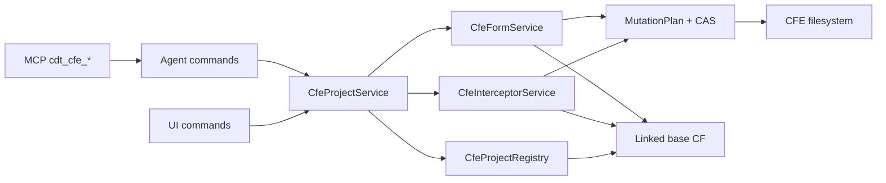

# Design issue #127 — перехваты и формы CFE

## Контекст и граница

Вертикаль строится поверх CFE context и ownership из #125/#126. Первая поддержанная матрица целей —
заимствованные `Catalog`, `Document`, `CommonModule`; формы — у `Catalog` и `Document`. Цель всегда
разрешается в связанной основной CF по UUID. Имя используется только для отображения и построения
проверенного пути после UUID-разрешения.

В scope входят структурные перехваты `Before`, `After`, `Instead`, `ChangeAndValidate`, создание
собственной формы, заимствование существующей формы и аддитивное расширение заимствованной формы.
Произвольная перезапись adopted form через обычный Form editor запрещается. Поддержка остальных
типов метаданных расширяется отдельным изменением матрицы после появления platform fixtures.

## Рассмотренные варианты

### Расширить общий form parser/writer

Минимум новых файлов, но существующая модель схлопывает несколько `Action`, не хранит `callType`,
не различает Part1/BaseForm и меняет порядок узлов. Исправление затрагивает все обычные формы и
создаёт высокий регрессионный риск.

### Вызывать vendored Python/PowerShell skills

Даёт готовый oracle, но вводит отдельный runtime, внешний процесс и второй mutation protocol.
UI, Agent и MCP перестают быть тонкими адаптерами одного TypeScript application service.

### Изолированный CFE domain — выбран

Структурные BSL и ordered-XML модели живут под `cfeProject`, используют общий registry, session,
MutationPlan, CAS и path boundary. Обычный form editor не меняется для own forms; adopted forms
получают fail-closed guard и изменяются только через `extendForm`. Vendored skills и спецификации
остаются oracle для fixtures и platform round-trip.

## Компоненты и dataflow

Все операции выполняются в FIFO extension session. Перед commit повторно проверяются fingerprint
`Configuration.xml`, исходного объекта, исходного модуля/формы и всех файлов, участвующих в плане.
Ни один адаптер не пишет XML или BSL напрямую.

## Перехваты BSL

`CfeCreateInterceptorRequest` содержит `extensionConfigurationId`, `targetSourceUuid`,
`moduleKind`, `methodName`, `kind` и необязательный `expectedSourceHash`. `moduleKind` ограничен
подтверждёнными модулями: `Module`, `ObjectModule`, `ManagerModule`, `RecordSetModule`,
`ValueManagerModule`. Совместимость module kind с типом объекта проверяет domain service.

`kind` имеет значения `before | after | instead | changeAndValidate`. Для функции `before/after`
отклоняются до записи. Для `changeAndValidate` `expectedSourceHash` обязателен и относится к
каноническому тексту исходного метода, а не ко всему файлу.

Структурный scanner учитывает строки, комментарии, директивы, многострочные сигнатуры,
`Процедура/Функция`, async, области и препроцессор. Он возвращает границы, имя, вид, параметры,
контекст размещения и канонический hash. Regex допускается только для отдельных токенов после
лексического разбиения, но не для поиска метода в сыром тексте.

Канонические директивы: `&Перед`, `&После`, `&Вместо`, `&ИзменениеИКонтроль`. Повтор цели с тем же
kind идемпотентен. Существующее непустое пользовательское тело не перезаписывается и даёт
`CFE_INTERCEPTOR_CONFLICT`. Начальный `ChangeAndValidate` канонически копирует неизменённое тело
исходного метода без искусственных маркеров. Структурная модель распознаёт и сохраняет пользовательские
`#Удаление/#КонецУдаления` и `#Вставка/#КонецВставки`; drift исходного hash даёт
`CFE_SOURCE_CHANGED`.

## Формы

`CfeCreateOwnFormRequest` адресует owner по CFE dot-path и создаёт обычную metadata form без
`ObjectBelonging`, `ExtendedConfigurationObject`, `BaseForm` и `callType`.

`CfeBorrowFormRequest` содержит `ownerSourceUuid` и ровно один `sourceFormUuid` или имя формы.
Owner уже должен быть заимствован в CFE. Сервис создаёт adopted metadata form, `Ext/Form.xml` и
неперезаписываемый `Module.bsl`. Идентичность формы — UUID исходной формы. Повтор идемпотентен.

`CfeExtendFormRequest` адресует adopted form по `sourceFormUuid`, принимает `expectedFormHash` и
непустой список аддитивных операций:

- `addAttribute`;
- `addCommand`;
- `addElement`;
- `setFormEvent`, `setElementEvent`, `addCommandAction`.

Поддерживаемые новые visual elements первой матрицы: `UsualGroup`, `InputField`, `Button`.
Ссылки проверяются на существующие parent/attribute/command. Операции не удаляют и не
перезаписывают BaseForm. Повтор элемента с тем же стабильным именем и тем же содержимым
идемпотентен; несовпадение даёт `CFE_VALIDATION_FAILED`.

Ordered serializer сохраняет Part1 первой, `BaseForm` последней, несколько `Action` и `callType`.
`BaseForm` не содержит Events/Commands/Parameters; `TypeLink Items.*` и element Events из base
части не копируются. `AutoCommandBar` имеет ID `-1`. Все создаваемые расширением атрибуты, команды
и visual elements получают монотонный ID от `1000000`; существующие ID никогда не переиспользуются.

`callType` в XML: `Before`, `After`, `Override`. Обработчики form events остаются обычными BSL
процедурами; BSL intercept decorators к ним не добавляются. Metadata `PropertyState=Extended`
создаётся только для форматов `2.19+`. Формат новых файлов всегда равен формату extension root;
для `2.21` добавляется palette namespace.

Зависимости формы разрешаются только из связанной CF. Первая матрица поддерживает CommonPicture,
StyleItem, Enum/EnumValue и типы реквизитов, уже присутствующие либо безопасно заимствуемые текущей
матрицей. Неподтверждённое замыкание отклоняется до записи `CFE_DEPENDENCY_UNSUPPORTED`.

## Generic editor guard

При открытии adopted `Ext/Form.xml` editor может читать модель, но обычный Save и создание handler
fail closed с `CFE_ADOPTED_OPERATION_REQUIRED`. Мутации выполняются отдельными CFE-командами через
`extendForm`. Own form продолжает использовать существующий editor без изменения поведения.

## Agent/MCP и ошибки

Добавляются Agent-команды `cfe.createInterceptor`, `cfe.createOwnForm`, `cfe.borrowForm`,
`cfe.extendForm` и одноимённые strict MCP tools `cdt_cfe_*`. UI использует те же service methods.
Exact catalog parity и все четыре annotations обязательны.

Новые стабильные коды: `CFE_INTERCEPTOR_CONFLICT`, `CFE_FORM_ID_EXHAUSTED`. Остальные ошибки
используют коды #125/#126. Ошибки не раскрывают пути вне workspace, connection strings или тело
чужого пользовательского модуля.

## Приёмка

- fixture matrix XML `2.17`–`2.21`;
- structural BSL tests: comments/strings, multiline, function restrictions, regions/preprocessor;
- idempotency, conflict, source drift, CAS rollback, symlink/path boundary;
- own/adopted form, Part1/BaseForm order, callType, multiple Action, ID allocator;
- generic adopted form Save fail closed;
- Agent/MCP exact parity и документация;
- реальный import/apply/export на 1С 8.3.27 для каждого вертикального сценария.
