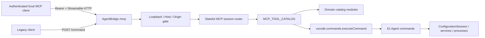

# MCP Agent Adapter — дизайн и ADR полного каталога

## Контекст

Agent API — прикладная граница: 61 команда в `registerAgentCommands` выбирает конфигурацию, проверяет capabilities, использует `ConfigurationSession`, вызывает общие services и возвращает `AgentResult`. MCP не становится вторым прикладным API и не вызывает operations/services напрямую.

Четыре UI-команды `borrowToExtension`, `navigateToMainObject`, `showRelatedObjects`, `showInterceptors` не зарегистрированы `registerAgentCommands`, не имеют `AgentResult`-контракта и не входят в MCP catalog.

## Варианты

### 1. Отдельный MCP HTTP server

Создаёт второй port/token/discovery/lifecycle и дублирует security. Отклонён.

### 2. Один `/mcp` route и один монолитный каталог

Сохраняет единый listener и thin dispatch, но 61 schema в одном файле создаёт высокую связность и неудобный review. Подход использован первой вертикалью, но не масштабируется на полный API.

### 3. `/mcp` в Agent Bridge и доменные catalog modules — выбран

Agent Bridge владеет HTTP/security/lifecycle. Stateful session router владеет MCP protocol. Доменные modules владеют только metadata tools: name, description, Agent command id, strict Zod schema и annotations. `toolCatalog.ts` агрегирует modules в единый экспортированный `MCP_TOOL_CATALOG`, регистрирует tools и использует общий `AgentResult → CallToolResult` mapper.

## Контейнеры и поток

HTTP errors не смешиваются с tool errors. Domain modules не исполняют команды и не преобразуют результаты. Единственный executor и mapper остаются в агрегаторе.

## Каталог и контракты

Доменные modules размещаются под `src/agent/mcpAdapter/catalog/`: common schemas/types, metadata, debug, bindings/deploy, type/subsystem/characteristics, forms, SKD и XDTO. Порядок агрегации фиксирован для стабильного `tools/list`; имена tool и command id уникальны.

Каждый definition содержит:

- стабильное `cdt_*` имя;
- ровно один `1c-metadata-tree.agent.*` command id;
- описание реального эффекта;
- strict Zod input schema с cross-field refinements;
- полный статический набор `readOnlyHint`, `destructiveHint`, `idempotentHint`, `openWorldHint`.

Annotations консервативны и отражают худший допустимый режим. Поэтому условно пишущие `xdto.exportXsd`, `skd.info`, `skd.validate` не read-only. Произвольный JavaScript `forms.exec` и BSL `debug.evaluate` destructive/open-world. Open-world выставляется для debug/forms/deploy/status и всех SKD tools: они взаимодействуют с процессами, debuggee, браузером, информационными базами либо локальными произвольными input/output paths.

## Инвариант покрытия

Source of truth для состава Agent API — фактическое выполнение `registerAgentCommands`. Contract test вызывает функцию на общем VS Code stub, читает runtime-capture `vscodeTestState.registeredCommandIds` и сравнивает множество с `MCP_TOOL_CATALOG.map(command)`. Regex или разбор исходного текста не используются: они не доказывают, что команда действительно зарегистрирована.

Тест требует:

- точного равенства множеств и текущего размера 61;
- отсутствия duplicate tool names и command ids;
- отсутствия четырёх UI-команд вне Agent API;
- соответствия каждого definition зафиксированным schema/annotation contracts.

Новая регистрация Agent command без MCP definition и удаление/переименование команды без синхронного изменения каталога становятся явным test failure.

## Очереди и cancellation

Thin executor не меняется: mutating tools вызывают соответствующую VS Code Agent-команду, поэтому сохраняют существующие `enqueue`/`enqueuePlan`, `operationId` и `snapshotVersion`. Debug/forms/SKD сохраняют текущую direct semantics; MCP не добавляет параллельную очередь.

Cancellation проверяется до и после dispatch. После dispatch принудительная отмена невозможна без изменения Agent signatures: выполняющаяся команда завершается, её результат отбрасывается, клиент получает `REQUEST_CANCELLED`.

## Security и trust boundary

Один loopback listener, Bearer, peer/Host/Origin validation и 16 MiB body limit остаются без изменений. Аутентифицированный локальный MCP-клиент имеет ту же authority, что legacy bridge client; annotations не являются authorization policy.

Расширение каталога включает команды с произвольным кодом и внешними эффектами, поэтому descriptions/annotations должны раскрывать эффект. Перед их публикацией `AgentDebugOperations.debugStart` и `debugStartFromBinding` перестают логировать `infobase`, connection string и полный launch config; operational log содержит только redacted безопасные признаки. Их собственный unsuccessful `AgentResult.error` также становится generic и не сериализует launch config/infobase. Общий error mapper по-прежнему не возвращает exception text/stack.

## Sessions, discovery и lifecycle

Протокол, discovery v2 и shutdown остаются прежними: initialize создаёт `McpServer + StreamableHTTPServerTransport`, последующие requests маршрутизируются по `MCP-Session-Id`, stop сначала закрывает sessions/SSE, затем sockets/listener и remove-if-owned discovery. Расширение tool catalog не меняет transport contract.
