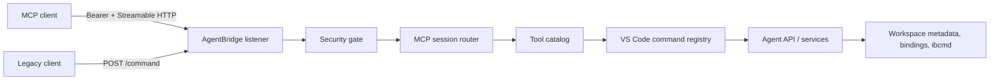

# MCP Agent Adapter — дизайн и ADR

## Контекст

Agent API уже является прикладной границей: команды выбирают конфигурацию, проверяют capabilities, используют `ConfigurationSession`, редактируют/читают через общие services и сериализуют ошибки в `AgentResult`. Новый MCP слой не должен стать вторым API с собственной предметной логикой.

## Варианты

### 1. Отдельный MCP HTTP server

Минимально затрагивает Agent Bridge, но создаёт второй port/token/discovery/lifecycle и вторую реализацию защиты. Отклонён из-за эксплуатационного и security-дублирования.

### 2. `/mcp` в Agent Bridge, отдельный session router — выбран

Один loopback listener, token и discovery. `AgentBridge` отвечает за HTTP/security/lifecycle, а изолированный MCP-компонент — за protocol sessions, tool catalog и mapping `AgentResult → CallToolResult`. Tools вызывают зарегистрированные Agent-команды.

Цена: транспорт остаётся связан с VS Code command registry; cancellation нельзя провести внутрь текущих command signatures. Для первой read-only вертикали это приемлемо и минимизирует риск семантического расхождения.

### 3. Общий `LoopbackHttpHost` с подключаемыми routes

Чище разделяет transport host, legacy bridge и MCP, но требует преждевременного рефакторинга проверенного bridge. Отложен до появления третьего route или второго потребителя security host.

## Решение

Принят вариант 2. Официальный production SDK v1 требует Node 18, поэтому совместимость меняется с VS Code `^1.80.0` на `^1.82.0`; собственная реализация протокола и pre-alpha SDK v2 не принимаются. Фабрика MCP сначала устанавливает WebCrypto, затем лениво загружает SDK, чтобы CommonJS evaluation не обратился к отсутствующему `globalThis.crypto` раньше bootstrap.

## Контейнеры и поток

HTTP transport errors (auth, host/origin, method, session) не смешиваются с tool errors. Tool catalog — единственный реестр имён, описаний, Zod input shapes и Agent command ids. Общий mapper сохраняет `AgentResult`; отдельные tools не переписывают результаты.

## Sessions и lifecycle

Новый `initialize` без session header создаёт пару `McpServer + StreamableHTTPServerTransport`. После инициализации UUID session регистрируется в map. Последующие `POST/GET/DELETE` маршрутизируются по `MCP-Session-Id`; неизвестная session получает protocol-compatible отказ. Event store/resumability и MCP Tasks не входят.

Bridge не принимает новые запросы после начала stop. Затем закрывает MCP servers/transports (включая SSE), активные sockets, HTTP server и только после этого свой discovery-файл. Discovery пишется temp+rename и содержит ownership marker, чтобы старое окно не удалило запись нового.

## Security boundaries

Bind на loopback дополняется проверкой peer address, Host и Origin до чтения/dispatch. Bearer обязателен на всех MCP methods и сравнивается как секрет; URL не содержит token. `listBindings` использует существующий redacted DTO. Ответы исключают stack trace; абсолютные пути остаются только там, где они уже являются частью авторизованного AgentResult и нужны для паритета.

## Эволюция

Mutation tools позже используют те же Agent-команды, поэтому сохранят очередь `ConfigurationSession`. Если понадобится полноценная cancellation/progress или transport-independent testing, Agent-команды можно перевести на общий typed application facade без изменения MCP tool contracts.
